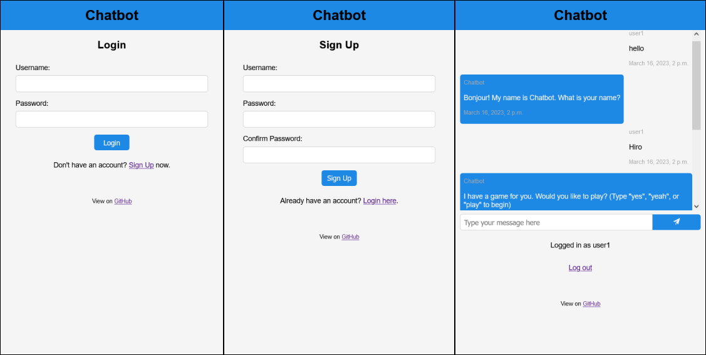

# Django Chatbot

This repository contains the source code for a chatbot developed using the Django web framework.
The chatbot is designed to interact with users, do authenticaion and save chat history 
for each user.

👉 [Live Demo](https://mankind.pythonanywhere.com)

### Screenshots

